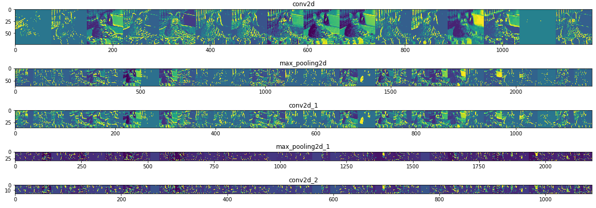
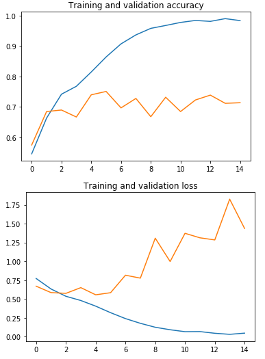

## TensorFlow version
TensorFlow 2 has been released, bringing with it major upgrades and changes!

Colab has two versions of TensorFlow pre-installed: 1.x and 2.x. Colab currently uses TensorFlow 1.x by default. To change it to 2.x, do the following:
```python
%tensorflow_version 2.x

import tensorflow
print(tensorflow.__version__)
```

### Avoid using `pip install` with GPUs and TPUs

Colab builds TensorFlow from source to ensure compatibility with our fleet of accelerators. Versions of TensorFlow fetched from **PyPI** by `pip` may suffer from performance problems or may not work at all.

## Visualizing Intermediate Representations


As you can see we go from the raw pixels of the images to increasingly abstract and compact representations. The representations downstream start highlighting what the network pays attention to, and they show fewer and fewer features being "activated"; most are set to zero. This is called `sparsity`. Representation sparsity is a key feature of deep learning.

These repreesntations carry increasingly less information about the original pixels of the image, but increasingly refined information about the class of the image. You can think of a **convnet** (or a deep network in general) as an `information distillation pipeline`.


As you can see, we are **overfitting** like it's getting out of fashion. Our training accuracy (in blue) gets close to 100% (!) while our validation accuracy stalls as 70%. Our validation loss reaches its minimum after only five epochs.

Since we have a relatively small number of training examples (2000), overfitting should be our number one concern. Overfitting happens when a model exposed to too few examples learns patterns that do not generalize to new data, i.e. when the model starts using irrelevant features for making predictions.

## Transfer Learning
Transfer learning is one of the most important techniques of deep learning and TensorFlow. Rather than needing to train a neural network from scratch which needs a lot of data and takes a long time, you can instead download a model that someone else has already trained on a huge dataset maybe for weeks and use those parameters as a starting point to then train your model just a little bit more on perhaps a smaller dataset that you have for a given task.

## Dropouts

The idea behind Dropouts is that they remove a random number of neurons in your neural network. This works very well for two reasons: 
1. The first is that neighboring neurons often end up with similar weights, which can lead to overfitting, so dropping some out at random can remove this.
2. The second is that often a neuron can over-weigh the input from a neuron in the previous layer, and can over specialize as a result. Thus, dropping out can break the neural network out of this potential bad habit!

Intuition: Can't rely on any one feature, so have to spread out weights.

