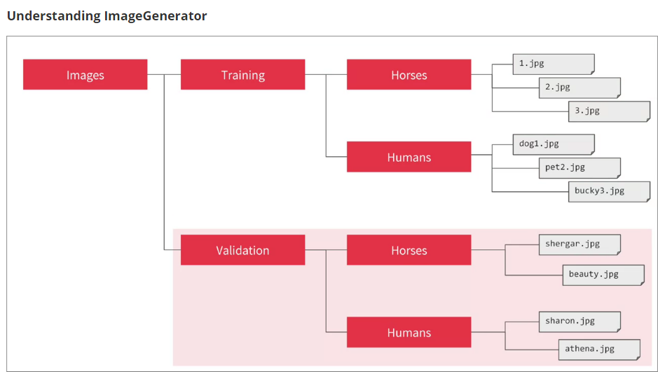

## Fashion MNIST data

```py
import tensorflow as tf
mnist = tf.keras.datasets.fashion_mnist
(traing_images, training_labels), (test_iamges, test_labels) = mnist.load_data()
```

All of the values in the numbers are between 0 and 255. If we are training a neural network, for various reasons, it's easier to treat all values as between 0 and 1, a process called '**normalizing**'... and fortunately in Python it's easier to normalize a list like this without looping.

```py
training_images = training_iamges / 255.0
test_images = test_images / 255.0
```

To design the model.
```py
model = tf.keras.models.Sequential([
    tf.keras.layers.Flatten(input_shape=(28, 28)),
    tf.keras.layers.Dense(128, activation=tf.nn.relu),
    tf.keras.layers.Dense(10, activation=tf.nn.softmax)])
```
**Sequential**: defines a SEQUENCE of layers in the neural network.
<br>
**Flatten**: Our image data are squares (arrays of arrays). Flatten just takes that square and turns it into a 1 dimensional set.
<br>
**Dense**: Adds a layer of neurons.
<br>
Each layer of neurons need an **activation function** to tell them what to do.
<br>
**Relu** effectively means "`If X > 0 return X, else return 0`" -- so what it does is it only passes values 0 or greater to the next layer in the network.
<br>
**Softmax** takes a set of values, and effectively picks the biggest one, so for example, if the output of the last layer looks like `[0.1, 0.1, 0.05, 0.1, 9.5, 0.1, 0.05, 0.05, 0.05]`, it saves you from fishing through it looking for the biggest value, and turns it into `[0, 0, 0, 0, 1, 0, 0, 0, 0]`-- the goal is to save a lot of coding.

Now that the model is defined, the next thing to do is to actually build it. You do this by compiling it with an **optimizer** and **loss** function, and then you train it by calling `model.fit`, asking it to fit your training data to your training labels.

```py
model.compile(optimizer = tf.train.AdamOptimizer(),
    loss = 'sparse_categorical_crossentropy',
    metrics = ['accuracy'])
model.fit(training_images, training_labels, epochs = 5)
```

The number of neurons in the last layer should match the number of classes you are classifying for.

To stop the training if the accuracy reaches a desired value -- i.e. 95%. If you reach that after 3 epochs, why sit around waiting for it to finish a lot more epochs.

```py
import tensorflow as tf

class myCallback(tf.keras.callbacks.Callback):
    def on_epoch_end(self, epoch, logs={}):
        if(logs.get('loss') < 0.4):
            print('\nReached 60% accurary so cancelling training!')
            self.model.stop_training = True

callbacks = myCallback()
mnist = tf.keras.datasets.fashion_mnist
(training_images, training_labels), (test_images, test_labels) = mnist.load_data()
training_images = training_images / 255.0
test_images = test_images / 255.0
model = tf.keras.models.Sequential([
    tf.keras.layers.Flatten(input_shape=(28, 28)),
    tf.keras.layers.Dense(512, activation = tf.nn.relu),
    tf.keras.layers.Dense(10, activation = tf.nn.softmax)
])
model.compile(optimizer = 'adam', loss = 'sparse_categorical_crossentropy')
model.fit(training_images, training_labels, epochs = 5, callbacks = [callbacks])
```

## Convolutional Neural Network
Simply put, **pooling** is a way of compressing an image.

Add some layers to do convolution before you have the dense layers, and then the information going to the dense layers is more focussed, and possibly more accurate.

You'll notice that there's a bit of a change here in that the training data needed to be reshaped. That's because the first convolution expects a single tensor containing everything, so instead of `60,000 28x28x1` items in a list, we have a single 4D list that is `60,000x28x28x1`, and the same for the test images. If you don't do this, you'll get an error when training as the Convolutions do not recognize the shape.

```py
import tensorflow as tf
mnist = tf.keras.datasets.fashion_mnist
(training_images, training_labels), (test_images, test_labels) = mnist.load_data()
training_images=training_images.reshape(60000, 28, 28, 1)
training_images=training_images / 255.0
test_images = test_images.reshape(10000, 28, 28, 1)
test_images=test_images/255.0
```

```py
model = tf.keras.models.Sequential([
  tf.keras.layers.Conv2D(64, (3,3), activation='relu', input_shape=(28, 28, 1)),
  tf.keras.layers.MaxPooling2D(2, 2),
  tf.keras.layers.Conv2D(64, (3,3), activation='relu'),
  tf.keras.layers.MaxPooling2D(2,2),
  tf.keras.layers.Flatten(),
  tf.keras.layers.Dense(128, activation='relu'),
  tf.keras.layers.Dense(10, activation='softmax')
])
model.compile(optimizer='adam', loss='sparse_categorical_crossentropy', metrics=['accuracy'])
model.summary()
model.fit(training_images, training_labels, epochs=5)
t
```

## To use non-unified images
### Image generator


`Sigmoid` is great for binary classification, where one class will tend towards zero and the other tending towards one.

One thing to pay attention to in this sample: We do not explicitly label the images as `horses` or `humans`. If you remember with the handwriting example earlier, we had labelled `'this is a 1'`, `'this is a 7'` etc. Later you'll see something called an `ImageGenerator` being used -- and this is coded to read images from subdirectories, and **automatically label them from the name of that subdirectory**. So, for example, you will have a 'training' directory containing a 'horses' directory and a 'humans' one. ImageGenerator will label the images appropriately for you, reducing a coding step.

Horse or Human CNN:
I was detected as a horse!


## Data processing
Let's set up data generators that will read pictures in our source folders, convert them to `float32` tensors, and feed them (with their labels) to our network. Our generators will yield batches of images of size 300x300 and their labels (binary).

```py
from tensorflow.keras.preprocessing.image import ImageDataGenerator

# All images will be rescaled by 1./255
train_datagen = ImageDataGenerator(rescale=1/255)

# Flow training images in batches of 128 using train_datagen generator
train_generator = train_datagen.flow_from_directory(
        '/tmp/horse-or-human/',  # This is the source directory for training images
        target_size=(300, 300),  # All images will be resized to 150x150
        batch_size=128,
        # Since we use binary_crossentropy loss, we need binary labels
        class_mode='binary')
```