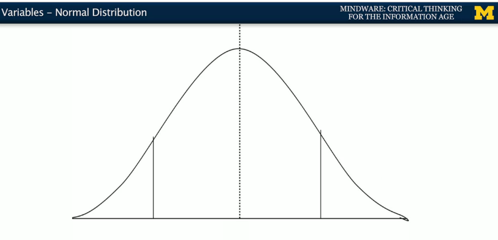
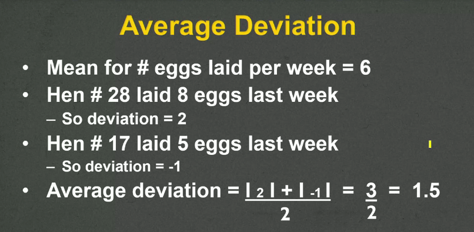

##Normal distribution
Variables are distributed in some way. One of the ways they're most frequently distributed is the `normal distribution`. It's called the normal distribution because it's so common. It's also sometimes called the `bell curve` because it looks like a bell.

In this kind of distribution, the `mean` is the most common value, and that's in the middle. As you get further and further away, from the mean, cases become rarer and rarer.

We can expect about `68%` of values to be within plus-or-minus 1 standard deviation.

