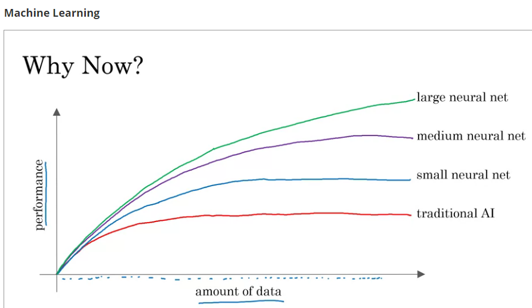
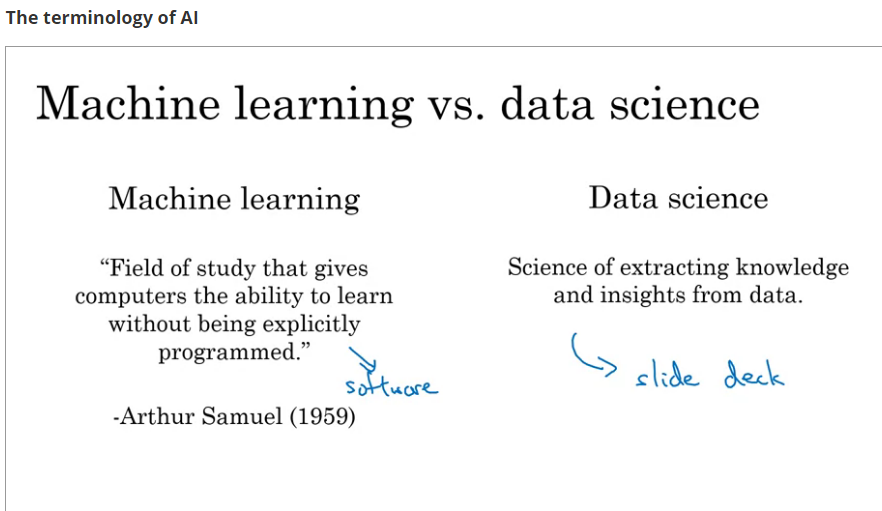
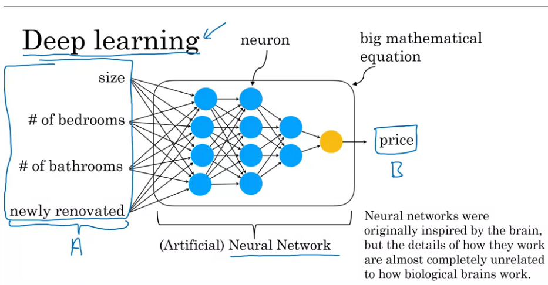
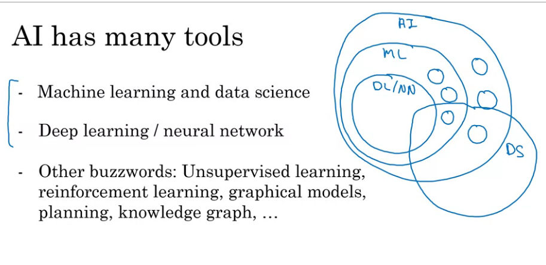
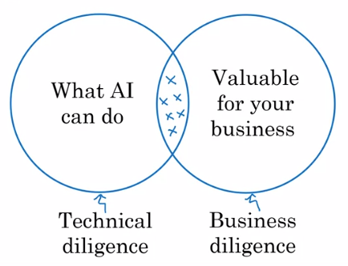

ANI and AGI

Supervised learning takes off in recent years thanks to the <mark>large amount</mark> of data available and the development of neural network.

### How to get data:
* Manually labeling
* From observing (users' or machines') behaviors
* Download from website / partnerships

### Use and mis-use of data
Don't wait until accumulating **enough** data. Get the AI team work on the data from the start.

The data may not generate valuable results.

### Data is messy
Unstructured data and structured data.

### Machine learning vs Data science

### Deep learning

### AI terminology.

### AI Transformation
1. Execute <mark>pilot projects</mark> to gain momentum
2. Build an in-house AI team
3. Provide broad AI training
4. Develop an AI strategy
5. Develop internal and external communications

### What makes an ML problem easier
1. Learning a "simple" concept
   * The problem takes a human less than 1 second of mental thought to solve.
2. Lots of data abailable

### Machine learning project workflow
1. Collect data
2. Train model
3. Deploy

### Data science project workflow
1. Collect data
2. Analyze data
   * Iterate many times to get good insights
3. Suggest hypotheses / actions
   * Deploy changes
   * Re-analyze new data periodically

### How to choose an AI project -> Brainstorming framework
* Think about automating tasks rather than automating jobs.
* What are the main drivers of business value?
* What are the main pain point in the business.

Before commiting to an AI project, do due diligence.

