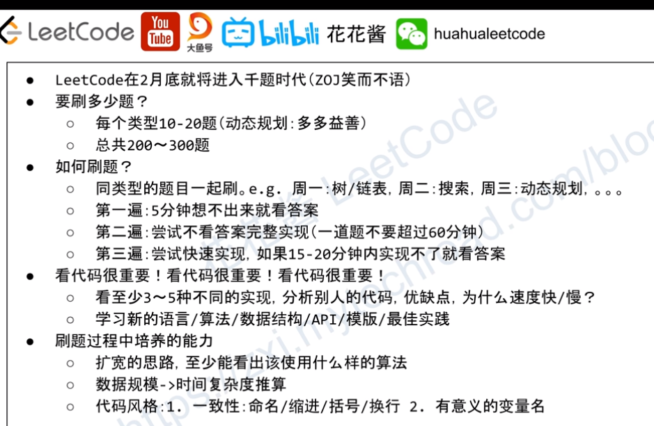

LeetCode刷题

* 时间规划，从面试日期倒着计划一下每天的题量（up主用了两个月时间)
* 不能从头开始一道一道地刷
* iPad，GoodNotes记笔记

[GitHub LeetCode题解](https://github.com/CyC2018/CS-Notes/blob/master/notes/Leetcode%20题解%20-%20目录.md)

YouTube Channels

* [Back to Back SWE](https://www.youtube.com/channel/UCmJz2DV1a3yfgrR7GqRtUUA)
* [Professor Sheep](https://www.youtube.com/channel/UCB7X04ICYJ_LMyFN3045wPw)
* [花花酱](https://www.youtube.com/user/xxfflower)s

