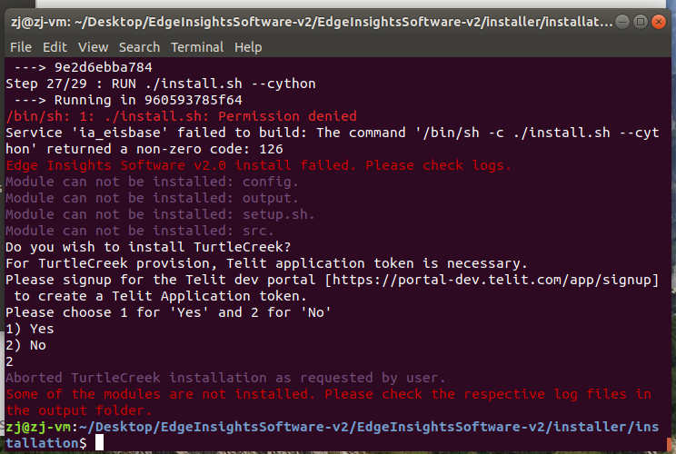

# 29/01/2020 Wednesday

TODO for tomorro:

* reinstall ubuntu in VM ?
* reinstall EIS in ubuntu VM

# 30/01/2020 Thursday

## Visual Computing team meeting (9:00 - 9:30)

My work update:

* Edge insights software
  * testing recognizing and detecting the object
* Inventory app
  * delayed
  * check with Martin of the deadline, (31/3?) and theFET (max 30%)

## Log

1. Reinstalled Ubuntu VM in VirtualBox

   1. By default the screen size of Ubuntu guest os is very small, at about `640 x 480`. Fixed this by attaching the `VBoxGuestAdditions.iso` file to the optical drive, and running the disk from Ubuntu guest os. [link](https://askubuntu.com/a/451825)
   2. Shared a folder between Windows and Ubuntu, but in Ubuntu when I clicked on the folder, message of "You don't have the permissions necessary to view the contents" popped up. This was fixed by running `sudo adduser [your-user-name] vboxsf`. This command add me to the shared folders group in the Ubuntu guest os. [link](https://askubuntu.com/a/890740)

2. Now installing the Edge Insights Software.

   1. The structure of the folders is as below. Last time when I tried out EIS, I was confused about the structure. I was uncertain whether EIS was installed or not, as there was the `IEdgeInsights` folder, but also the `installer` folder. In the end I didn't start from the `installer` folder but the `IEdgeInsights`.

      ```
      . EdgeInsightsSoftware-v2
      +---- Docs
      +---- IEdgeInsights
      +---- installer
      +---- turtlecreek
      +---- README.md
      ```

   2. Now I'm running the `installer\installation\setup.sh` script.

   3. EIS installation failed as the file `./install.sh` is not executable.
      
      
      Fixed this by adding one line to the original `Dockerfile.eisbase` script.

      ```
      RUN chmod +x ./install.sh  <--- added this line
      RUN ./install.sh --cython
      ```

   4. Another error. The fix:
   
      ```
      COPY . ./VideoIngestion/
      RUN chmod 755 ./VideoIngestion/vi_start.sh   <--- added this line
      ENTRYPOINT ["VideoIngestion/vi_start.sh"]
      ```

   5. <mark>Succeeded!</mark> The `setup.sh` installed all the stuff. When it finished, the EIS Visualizer App automaticlally popped up and the PCB demo is now being played.
      

3. When the system is freshly restarted, here is how to start the EIS.
   1. If docker-compose.yml is modified, run <mark>` $ sudo ./provision_eis.sh ../docker-compose.yml`</mark>.
   2. Run command `$ xhost +` before starting EIS stack. This is needed by `ia_visualizer` service to render the UI.
   3. Run `docker-compose up --build -d`. Or run the two steps like below:
      ```
      $ docker-compose build
      $ docker-compose up -d
      ```

4. I have tried other video files, ip camera, usb camera, webcam, and never succeeded. There is another option: use the <mark>camera simulation</mark> as stated in the user guide.

Unfortunately this approach is failing. Need to confirm again and then troubleshoot it.


# 3 Feb 2020 Monday

## EIS user guide readthrough

### System Architecture


One example that takes advantage of this northbound relationship is incremental learning. In solutions that leverage Deep Learning, the ability to fine tune or continuously improve the algorithm requires offline learning to occur. This can be done by sending Insights results to an On Premise or Cloud based training framework, and periodically retrain the model with the full data set, and then update the model on the Edge Insights System(s). 

The data flow in the EIS can be simplified as follows:


### EIS Message Bus and Configuration Management

EIS Message Bus is an abstraction over ZeroMQ* which is used for all inter-container communication in EIS. ZeroMQ message bus is a broker-less message bus implementing Pub-Sub and Request-Response patterns.

EIS uses **etcd** for configuratio management, which is a strongly consistent, distributed key-value store. 

Every service in `IEdgeInsights/docker_setup/docker-compose.yml` is a
* messagebus client if it needs to send or receive data over EISMessageBus
* etcd client if it needs to get data from etcd distributed key store

### Video Ingestion

#### Ingestor

A Gstreamer based pipeline is supported for reading from **basler/rtsp/usb** cameras through OpenCV.

#### filter

The <mark>Filter</mark> (**user defined function**) is responsible for doing pre-processing of the ingested video frames. It uses the filter configuration (in **etcd_pre_load.json**) to do the *selection of key frames* (frames of interest for further processing).

PCB filter checks the ingested video once **every 8 frames**. If in this 8th frame, the PCB is **in the center of the frame**, the data will be added to the output queue.

> We can use the same technique to do the pre-processing for the A1 project. If the boundary marker is in view of the camera, the frame data is ready to be passed to the next module to do further analysis. 

`training_mode` key in the filter configuration. </br>
`training_mode: If "true", used to capture images for training and building model`.</br>
> __**Need explanations on how to do training and building model.**__ Can the training only be done with OpenVINO? What does openVINO has to do with **training_mode** key in the filter configuration? In the configuration for Video Analytics, "HDDL" and "MYRIAD" devices require different model files than "CPU" and "GPU" devices.

### Video Analytics

Video Analytics module subscribes to the published input stream coming out of Video Ingestion module over messagebus to get (metadata, frame) tuple.

The <mark>Classifier</mark> (**user defined function**) is responsible for running the classification algorithm on the video frames received from filter.

The PCB demo sample application uses both computer vision and deep learning algorithms for detecting defects on the PCB board.

> The defects detected in the demo are missing components and shorts. We can modify this part to cater to our need to detect missing gear parts at the assembly platform.

### Factory Control App and Opcua Export App

Different modules in this software communicate through the EIS message bus in a publisher-subscriber mode. The Factory Control App subscribes to the output from the Video Analytics module, and controls the alarm light and reset button accordingly. The Opcua Export App module also subscribes to Video Analytics and then publishes to opcua clients.

> We can refer to these two apps to develop our customized notification mechanisms if abnormality is detected.

### Visualizer

Like the Factory Control App, the Visualizer subscribes to the published topic of Video Analytics module, and renders a bounding box when it detects a defects in the frame.

> This module is useful when we do development and testing, but could be disable in the production environment.

# 17 Feb 2020

Working on app development with `Flutter`.

## The different between `MaterialApp` and `Scaffold`
`MaterialApp` is the starting point of your app, it tells Flutter that you are going to use Material components and follow material design in your app.

`Scaffold` is used under `MaterialApp`, it gives you many basic functionalities, like `AppBar`, `BottomNavigationBar`, `Drawer`, `FloatingActionButton` etc.

So, this is how a typical app starts with.
```dart
void main() {
  runApp(MaterialApp(
    home: Scaffold(
      appBar: AppBar(),
      body: YourWidget(),
    ),
  ));
}
```

## Using Gradients in Flutter
[link](https://owenhalliday.co.uk/flutter-gradient/)

## Yellow lines under Text Widgets in Flutter?
What you're missing is an instance of `Theme` as a parent.

Why is that important to know? Because when you'll develop a Modal (using `showDialog` for example), you'll face the same problem. BUT Scaffold is an opaque fullscreen widget! And you obviously don't want that in your Modal.

There are many ways to introduce a Theme instance. In Material App, this is usually achieved by instantiating a `Material` Widget. And guess what? `Scaffold` creates one for you. But `Dialog` too!
<br>
[link](https://stackoverflow.com/a/47123685)